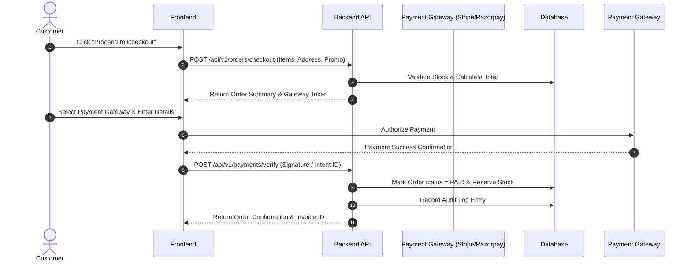

# 05 — Use Cases

## Use Case UC-01: Complete Customer Checkout Workflow

## Use Case UC-02: Admin Inventory Update & Audit Logging
1. Admin logs into platform (`admin@luxemarket.com`).
2. Admin navigates to Admin Panel -> Inventory Management.
3. Admin selects product and updates price/stock count.
4. Backend verifies Admin JWT token and updates database record.
5. Backend creates an entry in `audit_logs` table recording `action: PRODUCT_UPDATE`, `user_id`, `timestamp`, and `details`.
