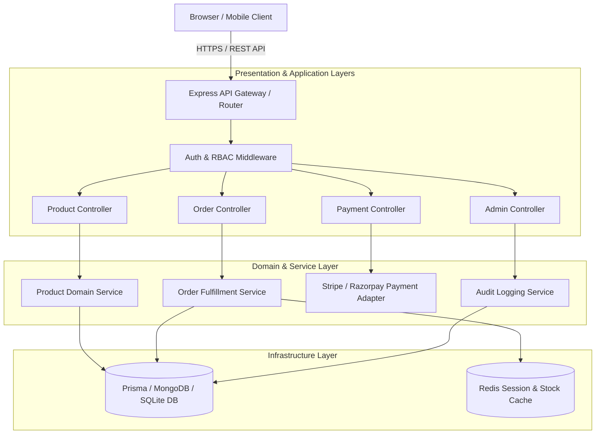

# 06 — System Architecture

## Architecture Diagram

## Architectural Decoupling Principles
- **Presentation Layer**: Express controllers handling HTTP status codes, payload parsing, and response formatting.
- **Application Layer**: Use cases validating inputs via Zod schema contracts and orchestrating domain services.
- **Domain Layer**: Core business models (Order entity state machine, Cart aggregation, Price calculation rules).
- **Infrastructure Layer**: Prisma ORM database repositories, Redis cache connector, Stripe SDK wrapper, and Razorpay API client.
