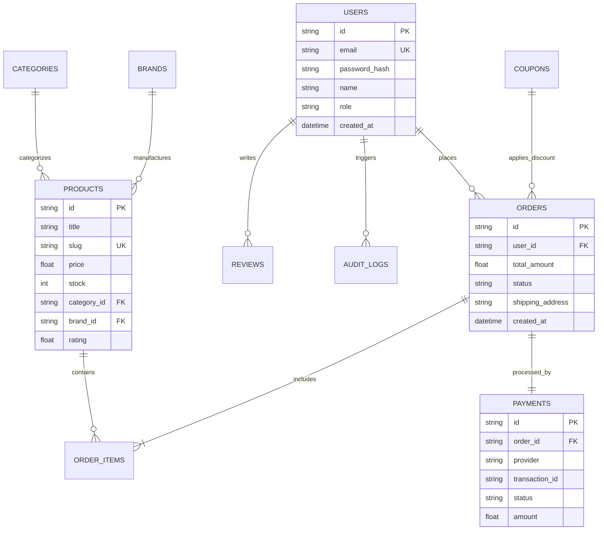

# 08 — Entity Relationship (ER) Diagram

```mermaid
erDiagram
    USERS ||--o{ ORDERS : places
    USERS ||--o{ REVIEWS : writes
    USERS ||--o{ AUDIT_LOGS : triggers
    CATEGORIES ||--o{ PRODUCTS : categorizes
    BRANDS ||--o{ PRODUCTS : manufactures
    PRODUCTS ||--o{ ORDER_ITEMS : contains
    ORDERS ||--|{ ORDER_ITEMS : includes
    ORDERS ||--|| PAYMENTS : processed_by
    COUPONS ||--o{ ORDERS : applies_discount

    USERS {
        string id PK
        string email UK
        string password_hash
        string name
        string role
        datetime created_at
    }

    PRODUCTS {
        string id PK
        string title
        string slug UK
        float price
        int stock
        string category_id FK
        string brand_id FK
        float rating
    }

    ORDERS {
        string id PK
        string user_id FK
        float total_amount
        string status
        string shipping_address
        datetime created_at
    }

    PAYMENTS {
        string id PK
        string order_id FK
        string provider
        string transaction_id
        string status
        float amount
    }
```
